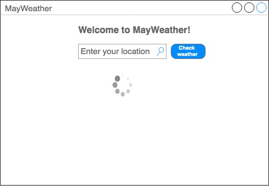

# Lab 3 - Proyecto MayWeather (a.k.a My Weather)


## Contexto

En el Lab 2 aprendimos un poco de programación orientada a objetos en Scala. También aprendimos lo que es backend y lo que es frontend, enfocandonos en el backend para desarrollar nuestra primer API Restful.

En este laboratorio, nos moveremos al frontend, y aprenderemos algunos principios básicos del framework más utilizado, en la actualidad, para construir aplicaciones web: [React.js](https://reactjs.org/) (React de ahora en más).

React es una librería de Javascript que permite el desarrollo de interfaces de usuario (UI) de forma declarativa, eficiente y flexible, permitiendonos componer UIs complejas a partir de piezas más pequeñas denominadas componentes.

## Requerimientos Funcionales

En este proyecto construiremos una aplicación web que provea información sobre el clima en una determinada ubicación.
La interfaz de usuario deberá ser realizada en React y los datos serán obtenidos de la API provista por [OpenWeatherMap](https://openweathermap.org/api).

A continuación se describen las funcionalidades mínimas que deberá tener nuestra aplicación.

**ACLARACION: Los mockups que se muestran son orientativos.**

### Página principal

En la página principal de la aplicación el usuario podrá buscar una localización (ciudad) en un **search box** y luego presionar el botón **CHECK WEATHER** para obtener la temperatura actual de la localización seleccionada. Durante el tiempo que se tarde en obtener la información sobre la temperatura, la aplicación deberá mostrar un **spinning wheel throbber**.



Una vez que la información esté disponible se deberá mostrar la misma en una sección principal de contenido. En esta sección se deberá poder navegar entre las siguientes secciones: **Current**, **Forecast**, y **UVI**.


#### Observaciones

- Existen diferentes formas de solicitar la información sobre una localización en particular, algunas más precisas que otras. Deberán elegir una e implementarla.

#### Extra Bonus

- Obtener la localización usando la **GeolocalizationAPI** del browser y auto completar el search box.
- Permitir que el usuario pueda elegir el sistema métrico en el que quiere expresada la información.

### Current

En esta sección se mostrará la información sobre el clima actual para localización seleccionada por el usuario. Esta información es lo primero que por defecto que debe mostrarse.

La información se deberá presentar en un weather card con los siguientes datos:

* ícono del clima,
* temperatura,
* descripción del clima,
* presión,
* humedad,
* viento,
* temperaturas máxima y mínima,
* horario del amanecer y de la puesta del sol.


Donde corresponda se deberá mostrar la unidad de medición correspondiente (e.g. `Cº` si la temperatura esta en grados Celsius).

### Forecast

En esta sección se mostrará la información sobre el pronóstico del clima para localización seleccionada por el usuario.

La información deberá ser presentada en un **forecast strip** con un **forecast card** para cada uno de los próximos 5 días.

El forecast card deberá presentar la siguiente información:

* día (nombre del día y fecha),
* ícono del clima,
* temperatura máxima,
* temperatura mínima.


Donde corresponda se deberá mostrar la unidad de medición correspondiente (e.g. `Cº` si la temperatura esta en grados Celsius).

Cuando el usuario haga **click** en el forecast card correspondiente a un día determinado, se deberá mostrar un detalle del pronóstico para ese día. Este detalle consistirá en un weather card con información del pronóstico cada tres horas.

El weather card deberá presentar la siguiente información:

* rango horario al que pertenece la información,
* ícono del clima,
* temperatura,
* descripción del clima,
* presión,
* humedad,
* viento,
* probabilidad de lluvias,
* temperaturas máxima y mínima,


El detalle para un dia se podrá mostrar debajo del forecast strip o en un modal.

### UVI (Extra Bonus)

En esta sección se mostrará información relacionada al UVI index para la localización seleccionada.

Se deberá mostrar el UVI index actual y graficar el mismo en una escala de UVI. También se deberá mostrar el forecast del UVI para los próximos 5 días y un gráfico con el UVI index de los últimos 30 días.


## Requerimientos No Funcionales

- Los errores deberán ser manejados apropiadamente mostrando un mensaje en pantalla. Es importante que si la aplicación falla no lo haga de manera silenciosa.

- Se utilizará como base para el estilo de código en ReactJS las convenciones del [AirBNB React/JSX Style Guide](https://github.com/airbnb/javascript/tree/master/react). Se prestará mucha atención a que el código sea legible, con las indentaciones correctas y el buen uso del espacio (i.e. no hagan líneas de más 80 caracteres). No es necesario sufrir para lograr esto: [instalen ESLint y todos los plugins que necesitan](https://medium.com/comparethemarket/eslint-visual-studio-code-editor-integration-for-the-win-1bcf38f6ccd4).

- Relacionado al punto anterior: **Componentes distintos en archivos distintos**. No se requiere específicamente un componente por archivo, pero sí que la modularización sea efectiva. Es decir, los componentes que son claramente distintos y tienen propósitos distintos no deberían estar en el mismo archivo.

- El diseño de los componentes deberá ser atómico ([Single Responsibility Principle](https://en.wikipedia.org/wiki/Single_responsibility_principle)). Los componentes deben concentrarse en tener una funcionalidad específica, y no cubrir muchos aspectos.

- Tener cuidado con el manejo del estado. En general es buena idea que pocos componentes tengan que lidiar con estado. Por otra parte [los componentes tienen que manejar solo su estado y/o el de sus hijos](https://reactjs.org/docs/lifting-state-up.html). No hay manejo de estado entre componentes hermanos.

- Usar [JSX](https://reactjs.org/docs/introducing-jsx.html) como medio para declarar elementos del DOM.

- Todos los componentes deberán hacer chequeo de tipos utilizando [PropTypes](https://reactjs.org/docs/typechecking-with-proptypes.html).

- En el README deben detallar los componentes de terceros que utilizaron, los pasos manuales de instalación y ejecución (si los hubiere), configuraciones manuales, decisiones de diseño, etc.
 

## Recomendaciones

- Busquen en Google antes de implementar y/o preguntar! Existen infinidad de posts sobre react.
- No reinventen la rueda, Seguramente ya existe un component en react que hace lo que queres hacer...buscalo.
- El diseño atómico sirve para poder probar cada componente de a poco. Úsenlo!
- No renieguen con el estilo. Concéntrense en hacer funcionar el laboratorio. Si luego sobre tiempo pueden hacerlo lindo. Si quieren hacer algo un poco más estético, les recomendamos no perder el tiempo y usar algo simple como [Bootstrap](https://www.techiediaries.com/react-bootstrap/) o [Material UI](https://material-ui.com/).

- Aprendan a utilizar la consola de developer en Chrome y/o Firefox. En particular instalen el addon [ReactDev Tools](https://chrome.google.com/webstore/detail/react-developer-tools/fmkadmapgofadopljbjfkapdkoienihi?hl=en) que les va a facilitar mucho el trabajo!
- En términos generales, es mejor comenzar un componente sin estado y eventualmente agregarle estados si el componente requiere muchas propiedades cuando es llamado.
- 
#### Links Utiles

- [A re-introduction to Javascript](https://developer.mozilla.org/en-US/docs/Web/JavaScript/A_re-introduction_to_JavaScript)
- [Tutorial de React](https://reactjs.org/tutorial/tutorial.html) 
- [Conceptos principales de React](https://reactjs.org/docs/hello-world.html)
- [Componentes de React](https://reactjs.org/docs/react-component.html)
- [Documentación de axios](https://github.com/axios/axios)
- [Documentación de React
  Router](https://reacttraining.com/react-router/web/guides/philosophy)
- [Presentational and Container
  Components](https://medium.com/@dan_abramov/smart-and-dumb-components-7ca2f9a7c7d0)
- [Atomic web design](http://bradfrost.com/blog/post/atomic-web-design/)
- [Lifting the state up](https://reactjs.org/docs/lifting-state-up.html)
- [JSX](https://reactjs.org/docs/jsx-in-depth.html)
- [PropTypes](https://reactjs.org/docs/typechecking-with-proptypes.html)
- [AirBNB React/JSX Style
  Guide](https://github.com/airbnb/javascript/tree/master/react)
- [Thinking in React](https://reactjs.org/docs/thinking-in-react.html)
- [ReactDev Tools](https://github.com/facebook/react-devtools)
- [9 things every React.js beginner should
  know](https://camjackson.net/post/9-things-every-reactjs-beginner-should-know)
- [ReactStrap](https://reactstrap.github.io/)
- [Lodash](https://lodash.com/), una librería para trabajar más cómodamente con
arreglos, objetos y demás.

## Entrega

- **Fecha de entrega:** hasta el 07/06/2019 a las 23:59:59.999

- Deberán crear un tag indicando el release para corregir.

	```
git tag -a lab-3 -m 'Entrega Laboratorio 2' && git push --tags
	```

Si no está el tag no se corrige. Tampoco se consideran commits posteriores al tag.

